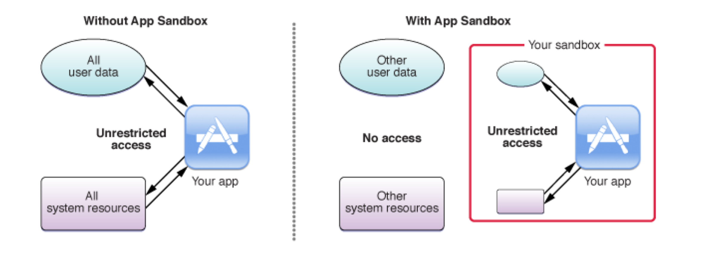
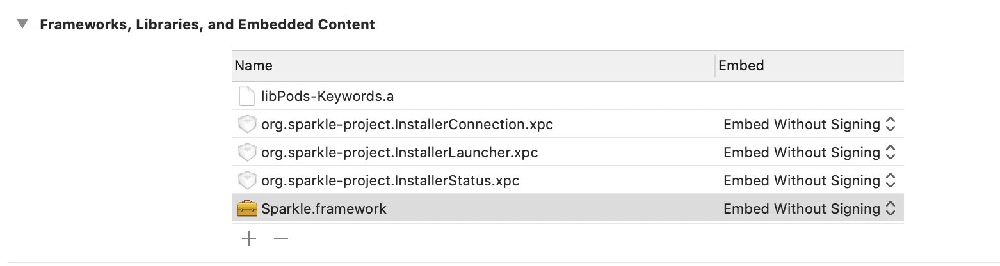
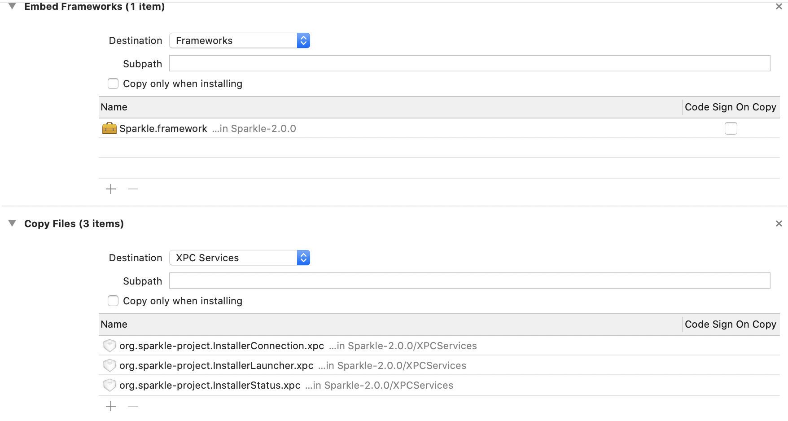

# macOS App

## Code Sign

- Apple Development
- Apple Distribution

## App Sandbox




# Sparkle (In-App Update)

- CocoPods: pod ‘Sparkle’
- Set up a Sparkle updater object
- Set up `SUFeedURL` property in **Info.plist**
- Public Distribution Group (App Center)


# EdDSA (Edwards-curve Digital Signature Algorithm)

- Generate Public and Private Key (./bin/generate_keys)
- Set up SUPublicEDKey in Info.plist
- Generate EdDSA signature (./bin/sign_update)
- PATH signature to release (API)
- Validating Update


# Sandboxing and Sparkle 2.0

## [Sparkle 2.0](https://github.com/sparkle-project/Sparkle/blob/2.x/README.markdown)

## Integration Steps

### 1. Enable App Sandboxing if you need

### 2. Make latest Sparkle 2.0 build

git clone 

```
cd <path-to>/Sparkle/

make release
```

[link](https://github.com/sparkle-project/Sparkle/blob/ui-separation-and-xpc/INSTALL.markdown#building)

### 3. Drag Sparkle.framework and XPC files to project



### 4. Copy XPC files to XPC Service



